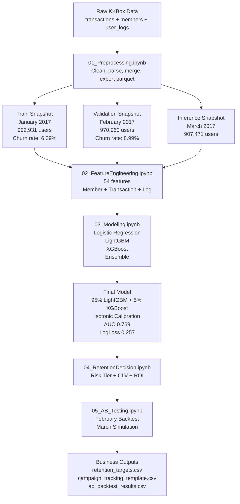

# Customer Churn Prediction and Campaign Analytics for Music Subscription Platforms

> **Course:** Data-Driven Marketing | **Institution:** National Economics University
> **Class:** DSEB 65B | **Supervisor:** Dr. Nguyen Tuan Long | **Hanoi, April 2026**

---

## Group 6

| Name | Student ID |
|---|---|
| Doan Tung Lam | 11230555 |
| Nguyen Manh Cuong | 11230521 |
| Tran Thu Hien | 11230534 |
| Do Ha Linh | 11230557 |
| Pham Minh Bao Ngoc | 11230576 |

---

## 1. Project Overview

This project builds an end-to-end **customer retention optimization framework** for **KKBox**, a music streaming platform operating in Taiwan, Hong Kong, Japan, and Southeast Asia. 

Using the [WSDM Cup 2018 Kaggle competition](https://www.kaggle.com/c/kkbox-churn-prediction-challenge) dataset, 

The primary objective is not competition leaderboard performance but a **deployable business retention framework** — one that translates raw churn probabilities into per-customer voucher decisions grounded in Customer Lifetime Value (CLV) and economic break-even logic. The methodology is inspired by Bryan Gregory's first-place solution (LogLoss 0.07974).

The goal is not only predicting churn, but determining:

```Which customers should be targeted, how much should be spent, and whether the campaign generates positive ROI.
```

**Business Questions**

| Business Question | Project Component |
|---|---|
| Which users are likely to churn? | Churn prediction model |
| How risky is each user? | Risk tier segmentation |
| Which users are financially worth saving? | CLV and break-even analysis |
| What retention action should be taken? | Voucher recommendation engine |
| Is the campaign likely to create measurable lift? | A/B testing backtest and simulation |

**Final workflow**

```text
Raw KKBox Data
    → Data Cleaning
    → Feature Engineering
    → Churn Modeling
    → Probability Calibration
    → Retention Decisioning
    → A/B Testing
    → Business Recommendation
```

---

## 2. Business Problem

```text
Traditional churn projects stop at probability prediction:

P(churn) = 0.08

However, retention campaigns require economic decision-making.   
This project extends churn modeling into a deployable retention system by combining:

- Churn probability
- Customer Lifetime Value (CLV)
- Voucher cost
- Expected retention uplift

Expected Profit =
(Churn Probability × CLV × Save Rate) − Retention Cost  

Only customers with positive expected profit are selected for targeting.
```

---

## 3. Key Results

### Modeling Performance

| Model | Validation AUC | Validation LogLoss | Role |
|---|---:|---:|---|
| Logistic Regression | 0.702 | 0.606 | Baseline |
| LightGBM | 0.766 | 0.290 | Best single model |
| XGBoost | 0.766 | 0.551 | Alternative boosting model |
| 95% LightGBM + 5% XGBoost | 0.769 | — | Best ensemble |
| Ensemble + Isotonic Calibration | 0.769 | 0.257 | Final model |

### Retention Campaign Results

| Metric | Value |
|---|---:|
| March inference users | 907,471 |
| Users targeted | 84,420 |
| Campaign cost | $2,517,531 |
| Expected revenue retained | $3,643,789 |
| Net benefit | $1,126,258 |
| ROI | 44.7% |

### A/B Testing Results

| Evaluation | Result |
|---|---|
| February backtest | No statistically significant lift |
| March simulation | Significant lift across 5 random seeds |
| Minimum viable Critical-tier save rate | 5% |

---

## 4. Dataset

The dataset is based on the **WSDM Cup 2018 KKBox Churn Prediction Challenge**.

Raw data should be placed in the `Data/` directory.

### Expected Input Files

| File| Description |
|---|---|
| `transactions.parquet` | Subscriptions Jan 2015 – Jan 2017 |
| `transactions_v2.csv` | Additional transactions Jan – Mar 2017 |
| `members_v3.csv` | User demographics and registration |
| `user_logs.parquet` | Historical daily listening (22,443 users) |
| `user_logs_v2.parquet` | March 2017 listening (316,345 users) |


### Key Data Challenges

- Dates are stored as `YYYYMMDD` integers and require parsing.
- Some transaction rows have invalid expiration logic and must be removed.
- Most registered members never transact, creating a large inactive-user population.
- Listening-log coverage is limited, so transaction features are more reliable than log features.
- March users require future April outcomes, which are not available in the public dataset.

---

## 5. Project Pipeline



---

## 6. Churn Definition

A user is labeled as churned if they fail to renew within **30 days** after membership expiration, following the official WSDM transaction reconstruction methodology implemented in `WSDMChurnLabeller.scala`.

---

## 7. Methodology

---

## Step 1 — Data Preprocessing

**Notebook:** `01_Preprocessing.ipynb`

Raw transaction, member, and listening-log data were cleaned and standardized into optimized parquet files.

Key preprocessing tasks:

- Merge historical and incremental transactions
- Parse YYYYMMDD date fields
- Remove corrupted subscription records
- Handle invalid demographic values
- Separate historical and March listening cohorts

**Output:** 5 clean parquet files + preprocessing metadata JSON

---

### Step 2 — Feature Engineering (`02_FeatureEngineering.ipynb`)

Constructs 54 behavioral and transactional features using strict temporal constraints to prevent data leakage.

**Time-based split:**

| Split | Month | Users | Churn rate | Labels |
|---|---|---|---|---|
| Train | Jan 2017 | 992,931 | 6.39% | `train.csv` (official) |
| Validation | Feb 2017 | 970,960 | 8.99% | `train_v2.csv` (official) |
| Inference | Mar 2017 | 907,471 | ~6.7% (implied) | `sample_submission_v2.csv` |

**Feature groups:**

| Group | Count | Key examples |
|---|---|---|
| Member | 10 | `registered_via`, `days_since_reg`, `registration_date_abs` |
| Transaction | 30 | `cancel_rate`, `last_is_cancel`, `auto_renew_rate`, `days_last_txn_to_expire` |
| Log | 13 | `total_secs_played`, `delta_secs_30d_vs_prior`, `days_since_last_login` |


A critical feature-engineering bug (`num_uniq` vs `num_uniq_songs`), caused several listening features to become zero-valued. Fixing the issue improved campaign ROI from 33% to 44.7%.

**Output:** `master_model_table.parquet` (1,963,891 × 59), `inference_snapshot.parquet` (907,471 × 55)

---

### Step 3 — Modeling (`03_Modeling.ipynb`)

Three machine learning models trained and evaluated on the February 2017 validation set.
- Logistic Regression
- LightGBM
- XGBoost

Final solution:

- 95% LightGBM + 5% XGBoost
- Isotonic probability calibration

Final performance:

- AUC: 0.769
- LogLoss: 0.257

Hyperparameter tuning was performed using Optuna.

**Output:** `submission.csv` (calibrated), model artifacts, `modeling_metadata.json`

---

### Step 4 — Retention Decision (`04_RetentionDecision.ipynb`)

Predicted churn probabilities were converted into customer-level retention decisions using:
- Risk-tier segmentation
- CLV estimation
- Voucher cost constraints
- Expected profit optimization

Only economically profitable users were selected for targeting.

Final campaign ROI: `44.7%`

**Output:** `retention_decision_table.csv`, `retention_targets.csv`, `campaign_tracking_template.csv`, `retention_metadata.json`

---

### Step 5 — A/B Testing (`05_AB_Testing.ipynb`)
The retention framework was evaluated using:

1. A February retrospective backtest with real labels
2. A March Monte Carlo simulation with synthetic outcomes

The February experiment showed no significant lift because many targeted users already had very high natural renewal rates.

The March simulation demonstrated that the framework can produce statistically significant uplift once model discrimination improves.

**Output:** `ab_tracking_table.csv`, `ab_backtest_results.csv`, `ab_test_metadata.json`

---

## 8. Key Findings

1. **Long-plan users churn at 72.4%** — 90-day plans attracted promotional users rather than loyal subscribers.

2. **Active-no-cancel users churn at 62.1%** — these are passive churners approaching natural membership lapse without explicitly cancelling. They look healthy by conventional metrics but are silently departing.

3. **Feature engineering quality mattered more than model complexity** — fixing one column-name bug increased ROI from 33% to 44.7%.

4. **The A/B null result is a diagnostic** — the model places safe users (99.4% natural renewal) in at-risk tiers. The simulation shows the framework produces +1.05% lift when the model correctly identifies churners.

5. **ROI is 44.7% at full reach and 48% at the highest-confidence threshold** — fewer but better-targeted users produces both lower cost and higher net benefit per dollar spent.

---

## 9. Repository Structure

```text
.
├── 01_Preprocessing.ipynb
├── 02_FeatureEngineering.ipynb
├── 03_Modeling.ipynb
├── 04_RetentionDecision.ipynb
├── 05_AB_Testing.ipynb
├── EDA_insight.ipynb
├── Understanding.ipynb
├── WSDMChurnLabeller.scala
├── kkbox_pipeline_diagram.md
├── Data/
├── Models/
│   ├── lgbm_model.txt
│   ├── xgb_model.json
│   └── ordinal_encoder.pkl
├── requirements.txt
└── README.md   
```

---

## 10. Installation

```bash
pip install -r requirements.txt
```

Key dependencies: `pandas`, `numpy`, `lightgbm`, `xgboost`, `optuna`, `scikit-learn`, `pyarrow`

---

## 11. How to Run

```bash
# 1. Place raw data files in Data/
# 2. Run notebooks in order
jupyter nbconvert --to notebook --execute 01_Preprocessing.ipynb
jupyter nbconvert --to notebook --execute 02_FeatureEngineering.ipynb
jupyter nbconvert --to notebook --execute 03_Modeling.ipynb
jupyter nbconvert --to notebook --execute 04_RetentionDecision.ipynb
jupyter nbconvert --to notebook --execute 05_AB_Testing.ipynb
```

---
## 12. Limitations

This project is designed as a realistic analytics framework, but several limitations remain.

1. *March outcomes are not directly observable*  
   March users require April renewal data, which is not available in the public dataset.

2. *The March A/B test is simulation-based*  
   The simulation depends on assumed save rates and calibrated churn probabilities.

3. *The February backtest is not a true causal experiment*  
   No real vouchers were sent, so it evaluates targeting quality rather than real treatment effect.

4. *Listening-log coverage is limited*  
   Transaction and membership features dominate because log data covers only a subset of users.

5. *Voucher save rates are assumptions*  
   These should be validated through a live campaign before production use.
---

## References

- B. Gregory, *Predicting Customer Churn: Extreme Gradient Boosting with Temporal Data*, arXiv:1802.03396, 2018.
- KKBox and Kaggle, *WSDM Cup 2018 Churn Prediction Challenge*, 2018.
