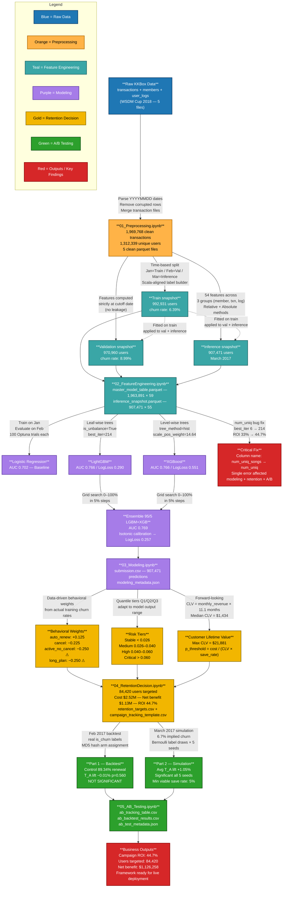

```mermaid
flowchart TD

%% =========================
%% STYLE DEFINITIONS
%% =========================
classDef raw      fill:#1f77b4,stroke:#0b3c68,stroke-width:2px,color:white;
classDef prep     fill:#ffb347,stroke:#b36b00,stroke-width:2px,color:black;
classDef fe       fill:#3aa6a6,stroke:#1f6666,stroke-width:2px,color:white;
classDef model    fill:#a67ce8,stroke:#5f3ca6,stroke-width:2px,color:white;
classDef retain   fill:#f2b600,stroke:#8a6f00,stroke-width:2px,color:black;
classDef ab       fill:#2ca02c,stroke:#145214,stroke-width:2px,color:white;
classDef output   fill:#d62728,stroke:#8b0000,stroke-width:2px,color:white;

%% =========================
%% RAW DATA
%% =========================
A["**Raw KKBox Data**
transactions + members + user_logs
(WSDM Cup 2018 — 5 files)"]:::raw

%% =========================
%% STEP 1 — PREPROCESSING
%% =========================
A -->|"Parse YYYYMMDD dates
Remove corrupted rows
Merge transaction files"| B["**01_Preprocessing.ipynb**
1,969,768 clean transactions
1,312,339 unique users
5 clean parquet files"]:::prep

%% =========================
%% STEP 2 — FEATURE ENGINEERING
%% =========================
B -->|"Time-based split
Jan=Train / Feb=Val / Mar=Inference
Scala-aligned label builder"| C1["**Train snapshot**
992,931 users
churn rate: 6.39%"]:::fe
B -->|"Features computed
strictly at cutoff date
(no leakage)"| C2["**Validation snapshot**
970,960 users
churn rate: 8.99%"]:::fe
B -->|"54 features across
3 groups (member, txn, log)
Relative + Absolute methods"| C3["**Inference snapshot**
907,471 users
March 2017"]:::fe

C1 -.->|"Fitted on train
applied to val + inference"| C2
C1 -.->|"Fitted on train
applied to val + inference"| C3

C1 & C2 & C3 --> D["**02_FeatureEngineering.ipynb**
master_model_table.parquet — 1,963,891 × 59
inference_snapshot.parquet — 907,471 × 55"]:::fe

%% =========================
%% STEP 3 — MODELING
%% =========================
D -->|"Train on Jan
Evaluate on Feb
100 Optuna trials each"| E1["**Logistic Regression**
AUC 0.702 — Baseline"]:::model
D -->|"Leaf-wise trees
is_unbalance=True
best_iter=214"| E2["**LightGBM**
AUC 0.766 / LogLoss 0.290"]:::model
D -->|"Level-wise trees
tree_method=hist
scale_pos_weight=14.64"| E3["**XGBoost**
AUC 0.766 / LogLoss 0.551"]:::model

E2 & E3 -->|"Grid search 0–100%
in 5% steps"| E4["**Ensemble 95/5 LGBM+XGB**
AUC 0.769
Isotonic calibration → LogLoss 0.257"]:::model

E4 --> F["**03_Modeling.ipynb**
submission.csv — 907,471 predictions
modeling_metadata.json"]:::model

%% =========================
%% STEP 4 — RETENTION DECISION
%% =========================
F -->|"Data-driven behavioral weights
from actual training churn rates"| G1["**Behavioral Weights**
auto_renew: +0.125
cancel: −0.225
active_no_cancel: −0.250 ⚠
long_plan: −0.250 ⚠"]:::retain

F -->|"Quantile tiers Q1/Q2/Q3
adapt to model output range"| G2["**Risk Tiers**
Stable < 0.026
Medium 0.026–0.040
High 0.040–0.060
Critical > 0.060"]:::retain

F -->|"Forward-looking
CLV = monthly_revenue × 11.1 months
Median CLV = $1,434"| G3["**Customer Lifetime Value**
Max CLV = $21,881
p_threshold = cost / (CLV × save_rate)"]:::retain

G1 & G2 & G3 --> H["**04_RetentionDecision.ipynb**
84,420 users targeted
Cost $2.52M — Net benefit $1.13M — ROI 44.7%
retention_targets.csv + campaign_tracking_template.csv"]:::retain

%% =========================
%% STEP 5 — A/B TESTING
%% =========================
H -->|"Feb 2017 backtest
real is_churn labels
MD5 hash arm assignment"| I1["**Part 1 — Backtest**
Control 89.34% renewal
T_A lift −0.01% p=0.560
NOT SIGNIFICANT"]:::ab

H -->|"March 2017 simulation
6.7% implied churn
Bernoulli label draws × 5 seeds"| I2["**Part 2 — Simulation**
Avg T_A lift +1.05%
Significant all 5 seeds
Min viable save rate: 5%"]:::ab

I1 & I2 --> J["**05_AB_Testing.ipynb**
ab_tracking_table.csv
ab_backtest_results.csv
ab_test_metadata.json"]:::ab

%% =========================
%% FINAL OUTPUTS
%% =========================
J --> K["**Business Outputs**
Campaign ROI: 44.7%
Users targeted: 84,420
Net benefit: $1,126,258
Framework ready for live deployment"]:::output

%% =========================
%% KEY INSIGHT CALLOUT
%% =========================
D -->|"num_uniq bug fix
best_iter 6 → 214
ROI 33% → 44.7%"| L["**Critical Fix**
Column name: num_uniq_songs → num_uniq
Single error affected modeling + retention + A/B"]:::output

%% =========================
%% LEGEND
%% =========================
subgraph Legend ["Legend"]
direction LR
LA["Blue = Raw Data"]:::raw
LB["Orange = Preprocessing"]:::prep
LC["Teal = Feature Engineering"]:::fe
LD["Purple = Modeling"]:::model
LE["Gold = Retention Decision"]:::retain
LF["Green = A/B Testing"]:::ab
LG["Red = Outputs / Key Findings"]:::output
end
```
